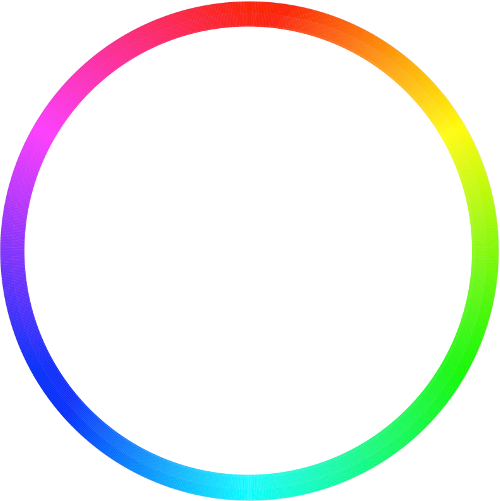

# hass-random-hue
Home Assistant scene component that takes a random hue, calculates its RGB value with full saturation and applies it to one or more lights.

## The HSV circle

Colors are taken randomly from the HSV circle.



## Installation

* If it doesn't exist yet, create a sub-folder in your configuration directory called `custom_components/scene`
* Download the [random_hue.py](random_hue.py) file and copy it to this sub-folder

## Prerequisites

This component requires at hass >= 0.66.

## Configuration

Add the following snippet to your `configuration.yaml`, or any file that is included by it:

```
scene:
  - platform: random_hue
    name: Random Colors
    lights:
      - light.RGB1
      - light.RGB2
    same_color: false
    transition: 1
```

### Parameters

* `name` (optional): the name of this scene
* `lights` (required): list of lights to apply random color values to
* `same_color` (optional): when `true`, all lights will be set to the same color. Otherwise, individual random colors are chosen.
* `transition` (optional): numeric value for the transition time

Note that the color of the lights is only changed if the lights are already switched on.

### Automation

Example automation to change the color to new random values every 5 minutes:

```
automation:
  - alias: Random color every 5 minutes
    trigger:
      platform: time
      minutes: '/5'
      seconds: '0'
    action:
      service: scene.turn_on
      entity_id: scene.random_colors
```

## License

GPLv2

